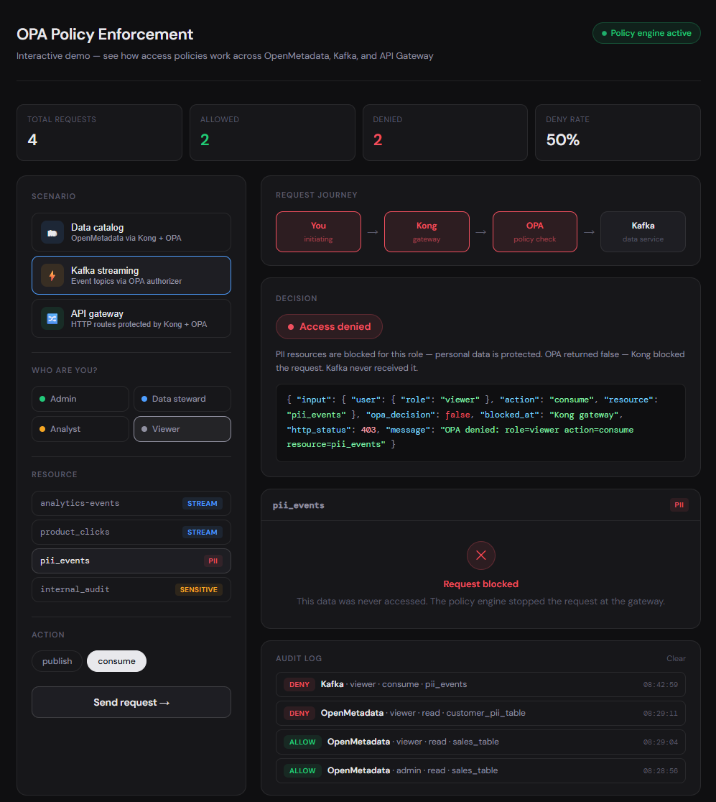

# OPA Policy Enforcement — Local Kubernetes Setup

## What this is

A working example of Open Policy Agent (OPA) enforcing authorization policies
across multiple services on a local Minikube cluster. Includes a no-code
interactive demo UI for presenting to non-technical audiences.



## Architecture

```
Client
  ├── → Kong Gateway → OPA → mock-catalog       (HTTP API / data catalog)
  ├── → kafka-opa-app → OPA → Kafka             (event streaming)
  ├── → Kong Gateway → OPA → OpenMetadata       (real data catalog)
  └── → Kong Gateway → demo-ui                  (interactive demo)
                ↑
          single OPA pod
        policies/openmetadata.rego
        policies/kafka.rego
        policies/gateway.rego
```

## Setup guides by OS

| OS | Guide |
|----|-------|
| Windows 11 | [docs/setup-windows.md](docs/setup-windows.md) |
| macOS | [docs/setup-macos.md](docs/setup-macos.md) |
| Linux (Ubuntu/Debian) | [docs/setup-linux.md](docs/setup-linux.md) |

## Folder structure

```
opa-win11/
├── README.md
├── docs/
│   ├── setup-windows.md
│   ├── setup-macos.md
│   └── setup-linux.md
├── bootstrap.ps1                 # Bootstrap script (Windows)
├── bootstrap.sh                  # Bootstrap script (macOS/Linux)
├── teardown.ps1                  # Teardown (Windows)
├── teardown.sh                   # Teardown (macOS/Linux)
├── .gitignore
├── policies/
│   ├── openmetadata.rego
│   ├── kafka.rego
│   └── gateway.rego
├── data/
│   └── roles.json
├── tests/
│   └── authz_test.rego
├── mock-app/
├── kafka-app/
├── demo-ui/
├── k8s/
├── kafka/
├── kong/
└── openmetadata/
```

## Access URLs (all platforms)

| Service | URL |
|---------|-----|
| Demo UI | http://localhost:8090/demo |
| OpenMetadata | http://localhost:8585 |
| Mock catalog (direct) | http://localhost:8080 |
| Kong gateway | http://localhost:8090 |
| Kafka app | http://localhost:8091 |
| OPA API | http://localhost:8181/v1/data |

OpenMetadata login: `admin@open-metadata.org` / `admin`

## Role permissions

| Role | Read | Write | Delete | PII |
|------|------|-------|--------|-----|
| admin | yes | yes | yes | yes |
| data_steward | yes | yes | no | yes |
| analyst | yes | no | no | no |
| viewer | yes | no | no | no |

## Kafka topic permissions

| Role | Publish (normal) | Publish (pii_*) | Publish (internal_*) | Consume (allowed list) |
|------|-----------------|-----------------|----------------------|------------------------|
| admin | yes | yes | yes | yes |
| data_steward | yes | no | no | no |
| analyst | yes | no | no | yes |
| viewer | no | no | no | no |

Analyst allowed consume topics: `analytics_events`, `analytics-events`, `product_clicks`, `public_feed`

## OPA endpoints

| Service | Endpoint |
|---------|----------|
| OpenMetadata | POST /v1/data/openmetadata/authz/allow |
| Kafka | POST /v1/data/kafka/authz/allow |
| API Gateway | POST /v1/data/gateway/authz/allow |

## Git workflow (all platforms)

```bash
# Make a policy change
code policies/openmetadata.rego

# Test it
opa test ./policies ./tests -v

# Apply to running cluster
kubectl apply -f k8s/opa-configmap.yaml
kubectl rollout restart deployment/opa

# Commit
git add policies/openmetadata.rego k8s/opa-configmap.yaml
git commit -m "policy: restrict analyst access to sensitive tables"
git push
```
